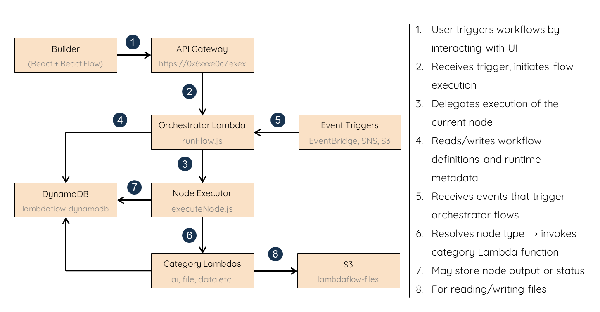

# ⚡ LambdaFlow – Drag. Drop. Deploy — Instant Serverless Automation 

### AWS Native Low-Code Automation Platform

LambdaFlow is a **low-code/no-code automation workflow builder** built natively on AWS, powered by **AWS Lambda** at its core. Designed for developers, ML engineers, analysts, DevOps teams, and hackathon builders, it enables users to orchestrate cloud-native workflows using modular, event-driven functions — all with zero infrastructure management. With every node running as its own Lambda function, scalability, modularity, and cost-efficiency are built in by design.

> 🔁 Design flows.  
> 🚀 Deploy.
> 🧩 Integrate APIs, AI, triggers, and transformations — all visually.

---

## 🎯 Why LambdaFlow?

Building serverless workflows should be fast, intuitive, and collaborative. While tools like AWS Step Functions offer robust orchestration capabilities, they can be better suited for large-scale production flows. LambdaFlow complements these tools by providing a lightweight, visual interface for rapid prototyping, automation, and experimentation — all powered by AWS Lambda.

- ✅ **No DevOps knowledge required**
- ⚙️ **Modular per-node Lambda execution**
- 🧠 **AI-enhanced workflows via Amazon Bedrock**
- 🌐 **Event-driven automation with API Gateway, EventBridge, S3, DynamoDB triggers**
- 🔄 **Drag-and-drop visual editor powered by React Flow**

---

## 👥 Who Is It For?

- **🧑‍💻 DevOps Engineers** – Automate tasks with S3, EventBridge, API Gateway triggers
- **🤖 ML Engineers** – Run document AI pipelines using Bedrock, Textract, Rekognition
- **🔧 Developers** – Build, test, and scale Lambda functions modularly
- **📈 Analysts** – Chain APIs, filters, alerts visually, without writing code
- **👨‍🏫 Hackathon Teams / Educators** – Rapidly demo automation workflows and share them

---

## 🧩 Features at a Glance

| Feature                            | Description                                                        |
| ---------------------------------- | ------------------------------------------------------------------ |
| ⚡ Drag-and-drop workflow UI       | Build flows visually using React Flow                              |
| ☁️ AWS-native serverless backend   | Each node runs as a separate Lambda                                |
| 📥 Triggers from AWS services      | API Gateway, S3, DynamoDB, SNS, Schedule, EventBridge              |
| 🤖 AI/ML Automation                | Summarization, classification, OCR using Amazon Bedrock & Textract |
| 🔁 Dynamic branching               | Loop over items using built-in branching                           |
| 📄 File support                    | Base64 file input/output support for document pipelines            |
| 🔍 Debug & Inspect                 | Node-wise status, summary, logs, and output                        |
| 💾 Save/Load from DynamoDB         | Workflows persist to AWS DynamoDB                                  |
| 🔐 IAM isolation per category      | Fine-grained roles for AI, triggers, data, file, utility           |
| 🚀 Deploy via Serverless Framework | All backend deployed as Lambda functions                           |

---

## 🛠️ Tech Stack

**Frontend:**  
React, React Flow, Material UI, Axios, JavaScript/ES6

**Backend:**  
Node.js, AWS Lambda, DynamoDB, EventBridge, Bedrock, Textract, Polly, Rekognition, S3, API Gateway, SNS, IAM Roles, Serverless Framework

**Infrastructure:**  
Serverless Framework, AWS IAM Policies, esbuild, dotenv

---
## 🧱 System Architecture Overview



---

## 📁 Folder Structure

```txt
lambda-flow/
├── backend/               # AWS Lambda handlers, orchestrator, node execution logic
│   ├── src/
│   │   ├── config/        # Node-category mapping
│   │   ├── core/          # Flow runner, execution engine, DynamoDB, EventBridge utils
│   │   ├── lambdas/       # Category-based Lambda function handlers
│   │   ├── nodes/         # Node logic grouped by category
│   │   └── server/        # Express dev server for local testing
│   ├── iam-policies/      # IAM policies grouped by category
│   └── serverless.yml     # Serverless Framework deployment config
│
├── frontend/              # Visual workflow builder UI
│   ├── public/            # Static files and favicon
│   ├── src/
│   │   ├── components/    # Custom React components
│   │   ├── config/        # Node specs and category metadata
│   │   ├── pages/         # Editor, load screen, trigger setup
│   │   └── utils/         # Workflow runner, helpers
│   └── package.json       # Frontend dependencies
│
├── docs/                  # Detailed architecture, guides, personas
│
└── README.md              # You're here 📘
```

## 🚀 Local Development Setup

### 1. Clone & Install

```bash
git clone https://github.com/TarunLakhmani/lambda-flow
cd lambda-flow
```

### 2. Frontend

```bash
cd frontend
npm install
npm run dev
# Runs on http://localhost:3000
```

### 3. Backend (Offline mode for local dev)

```bash
cd backend
npm install
IS_OFFLINE=true node src/server/index.js
# Runs on http://localhost:4000
```

---

## ☁️ Deploy to AWS (Serverless)

LambdaFlow is deployed using the [Serverless Framework](https://www.serverless.com/). All nodes and categories are packaged as individual AWS Lambda functions, each with scoped IAM permissions.

### Prerequisites

- AWS credentials configured (via CLI, IAM role, or `.aws/credentials`)
- AWS region set (defaults to `ap-south-1`)
- DynamoDB table: `LambdaFlowWorkflows` (auto-created if not existing)

### Deployment

```bash
cd backend
npm install
npx serverless deploy
```

This will deploy:

- AWS Lambda functions per node category
- API Gateway routes for workflow execution and triggers
- DynamoDB table for storing workflows
- IAM roles per category

---

## 🧭 Roadmap

### 🚀 What’s Coming Next

- ✨ **AI Copilot**: Build flows from natural language prompts
- 👯 **Collaboration Mode**: Real-time multi-user editing
- 🧠 **Prompt Chaining**: Multi-node generative AI workflows
- 🔌 **More Native Triggers**: CloudWatch Logs, SQS, and more

---

## 🧰 AWS Services Used in LambdaFlow

LambdaFlow leverages several AWS services to provide a fully serverless, scalable, and modular automation platform:

### 🧠 Core Compute & Orchestration

- **AWS Lambda** – Executes each node and category handler as a separate function
- **Amazon API Gateway** – Exposes REST endpoints for saving/loading/triggering workflows

### 🗄️ Data & Storage

- **Amazon DynamoDB** – Stores workflow definitions (nodes, edges, metadata)
- **Amazon S3** – Used for file operations in file-related nodes (read/write base64, file uploads)

### ⏰ Event-Driven Automation

- **Amazon EventBridge** – Triggers workflows on schedule or custom events
- **Amazon S3 Triggers** – Automatically invokes flows on file uploads
- **Amazon SNS** – Enables publish/subscribe event-based flow triggers
- **Amazon DynamoDB Streams** – Used to react to table changes as flow triggers

### 🔐 Security & Access Management

- **AWS IAM** – Category-scoped roles for least-privilege access to AWS resources

### 🧱 Developer & Deployment Tools

- **Serverless Framework** – Manages deployment, function configs, and IAM roles
- **serverless-esbuild** – Bundles Lambda functions using ES Modules (`type: module`)

---

LambdaFlow's serverless design ensures scalability, low cost, and minimal infrastructure management while integrating deeply with the AWS ecosystem.

---

Built with 💡 by a Cloud Automation Enthusiast.
