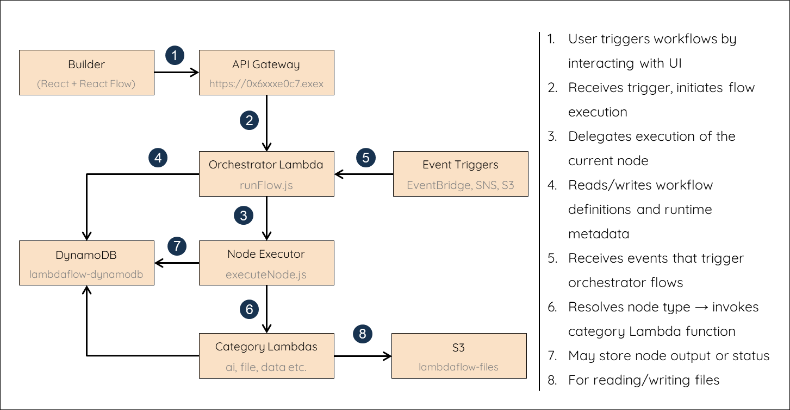

# 🏗️ LambdaFlow Architecture

LambdaFlow is a fully serverless, AWS-native, low-code automation platform where each node represents an independently invokable AWS Lambda function. This document outlines the system architecture, execution model, and AWS integrations that power the platform.

---

## 📐 Design Philosophy

- **Lambda-Centric Execution**: Each node in a workflow is mapped to a Lambda function.
- **Serverless Orchestration**: A custom Lambda-based orchestrator coordinates workflow execution.
- **Node-Level Isolation**: Individual Lambda functions ensure modularity and fault isolation.
- **Event-Driven Triggers**: External events (API Gateway, S3, SNS, EventBridge, etc.) initiate workflows natively.

---

## 🧱 System Architecture Overview



---

## 🔧 Key Components

### 🖥️ Frontend (`/frontend/`)

Built with **React**, **MUI**, and **React Flow**

**Features:**

- Visual node-based editor
- Node configuration and input panels
- Real-time execution status and debugging output
- Trigger testers (for API Gateway, Schedule, etc.)

---

### 🧠 Backend (`/backend/`)

#### 1. **Orchestrator** (`runFlow.js`)

- Handles execution of nodes based on DAG topology
- Builds input for each node by merging:
  - Global input
  - Static node input
  - Outputs of parent nodes
- Supports:
  - Branching (e.g., loop over items)
  - Termination signaling
  - Shared context between nodes

#### 2. **Node Executor** (`executeNode.js`)

- Maps `nodeType` to corresponding Lambda function via `nodeMap`
- Fallbacks to local `import()` if `IS_OFFLINE=true`
- Executes node logic and wraps result as:
  - `summary`
  - `details`
  - `output`
  - `success` (boolean)

#### 3. **Category Lambda Functions**

Each node category (e.g., `ai`, `data`, `file`) is backed by a dedicated Lambda handler.

- Dynamically imports the appropriate node logic:
  ```js
  const module = await import(`../../nodes/ai/summarizetext.js`);
  ```

### 🔐 IAM Category Roles

IAM roles are consolidated at the **category level** to enforce modular permissions and reduce overprivilege.

**Deployed Category Lambda Functions:**

- `aiCategory`
- `dataCategory`
- `fileCategory`
- `controlCategory`
- `notificationsCategory`
- `integrationsCategory`
- `utilityCategory`

---

### 📦 Workflow Store (DynamoDB)

**Table**: `LambdaFlowWorkflows`

**Stores:**

- `workflowId`
- `nodes[]`
- `edges[]`
- `createdAt`, `updatedAt`

**API Routes:**

- `POST /save-workflow/:workflowId`
- `GET /load-workflow/:workflowId`
- `GET /list-workflows`

---

### 🔔 Trigger Handlers

LambdaFlow supports cloud-native triggers that initiate flow execution.

**API Gateway:**

- `POST /trigger/apigateway/:workflowId`

**Other Supported Triggers:**

- `schedule`
- `eventbridge`
- `sns`
- `s3`
- `dynamodb`

---

### 🔁 Branching Support

Nodes may return a `branches` array to dynamically fan out execution paths:

```json
{
  "branches": [{ "region": "us-east-1" }, { "region": "eu-west-1" }]
}
```

### 🔁 Branch Execution Strategy

The orchestrator will execute each downstream node **once per branch**, passing the branch object as its **input context**. This enables parallel or serial execution patterns over lists, region-based logic, or any dynamic fan-out pattern.

---

### 🧪 Offline Mode Behavior

**Behavior:**

- Dynamically imports and runs the node logic using `import()`
- Simulates the behavior of AWS Lambda locally within the orchestrator
- Allows rapid prototyping, live editing, and full end-to-end workflow testing without needing to deploy

This mode is essential for fast iteration during development and debugging.

---

### 🔐 IAM Role Strategy

IAM roles are scoped **per node category** and defined using dedicated JSON policy files, referenced directly in the Serverless Framework config.

**Example: `aiCategoryRole` IAM Policy Definition**

```yaml
Resources:
  AiCategoryRole:
    Type: AWS::IAM::Role
    Properties:
      RoleName: ai-category-role
      AssumeRolePolicyDocument:
        Statement:
          - Effect: Allow
            Principal:
              Service: lambda.amazonaws.com
            Action: sts:AssumeRole
      Policies:
        - PolicyName: ai-category-policy
          PolicyDocument: ${file(./iam-policies/aiCategory.json)}
```

This ensures each Lambda function has access only to the specific AWS services it requires, enforcing **least-privilege access** and strong **security boundaries**.

---

### 🚀 Deployment

LambdaFlow is deployed using the **Serverless Framework**, bundled with **serverless-esbuild** for optimized ES Module (`esm`) support.

**Deployment Features:**

- Format: **ES Modules** with `"type": "module"` across all Lambda functions
- Each category-level function is deployed independently for fast iteration and isolation
- **Scoped IAM roles** defined in `iam-policies/*.json` for secure access control
- **Environment variables** configured on a per-function basis
- **Memory and timeout parameters** tuned to match node behavior and expected workloads
- **Incremental builds and updates** reduce cold starts and speed up deployments

---

### ✅ Summary

LambdaFlow brings together the power of **AWS Lambda** and the simplicity of a **drag-and-drop workflow editor**. By executing each node as an isolated Lambda function, supporting AWS-native event triggers, and managing orchestration with a robust DAG engine, it enables scalable, modular, and intuitive automation — with zero infrastructure management required.
